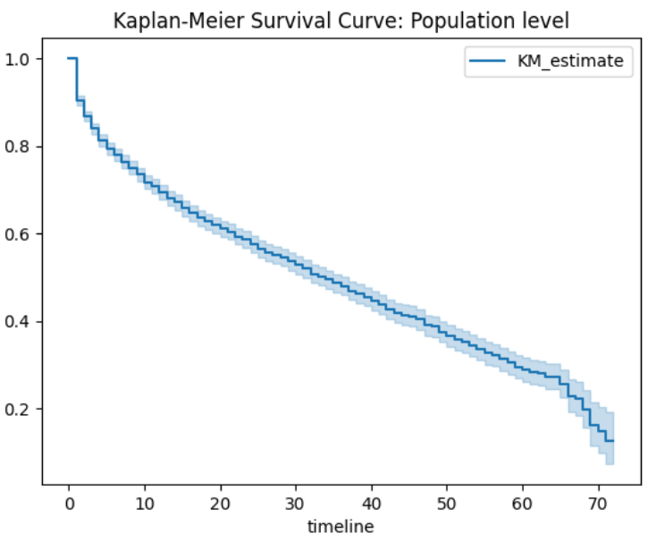
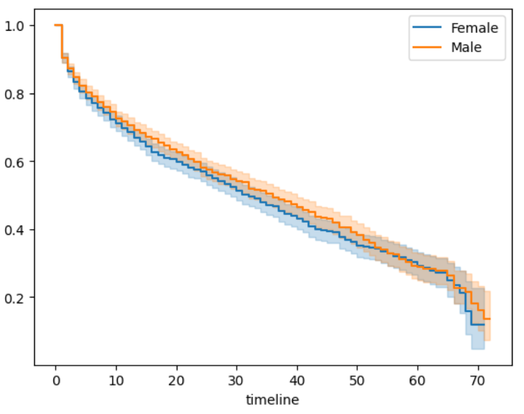
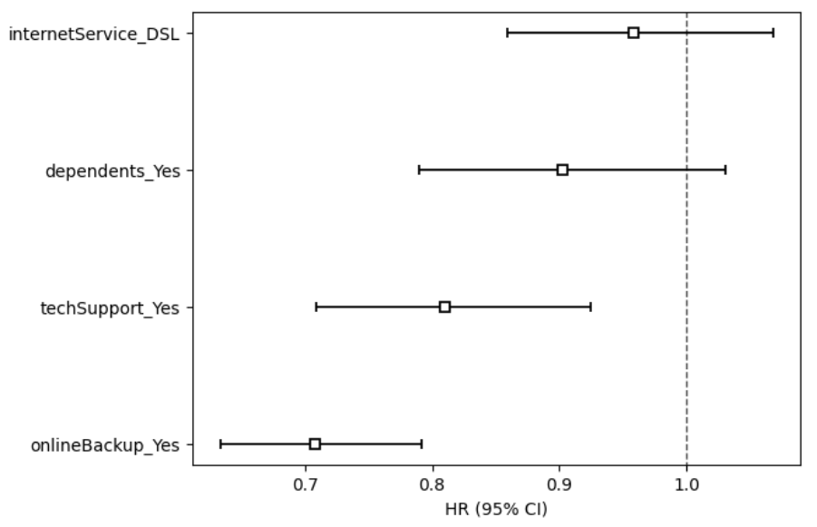
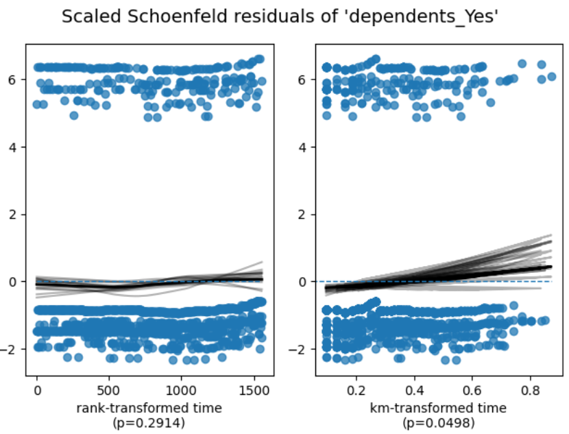
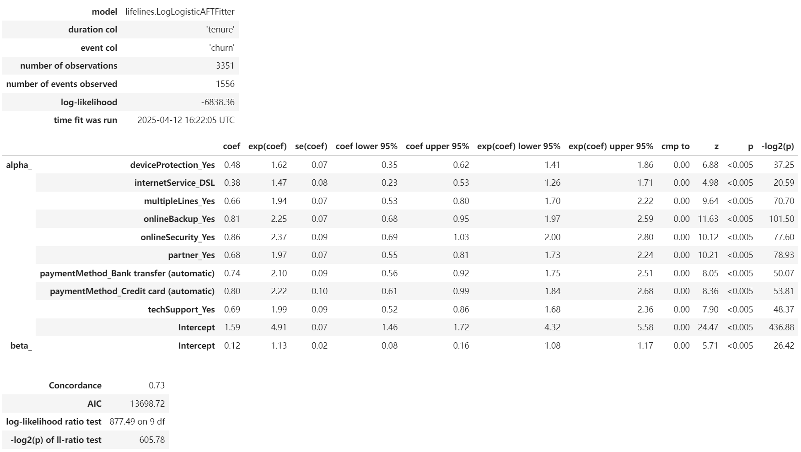
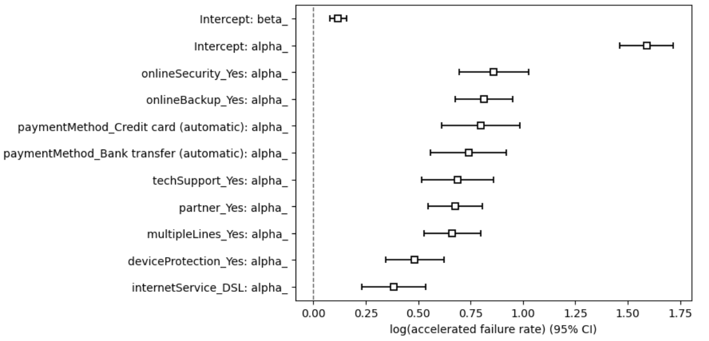
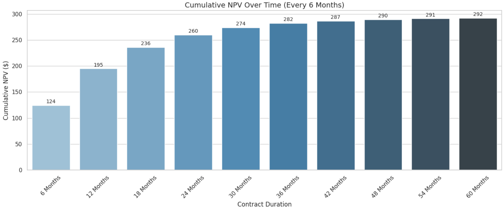

# Q2.2 Survival Analysis Report 

### 12212826 肖涵曦

---

## 01_Intro

### Overview

生存分析（Survival Analysis）是一系列统计方法，旨在分析和预测某一事件发生所需的时间。该方法最早起源于医疗行业，主要关注“至死亡时间”的建模与推断。随着研究的发展，生存分析已广泛应用于各行各业，包括金融、电信、制造、保险等。

### Telco Use Case Examples

在电信行业，生存分析可广泛应用于如下业务场景：

- **客户留存（Customer Retention）**：通常认为，保留现有客户的成本低于获取新客户的成本。以取消服务作为事件变量，生存分析可帮助 Telco 企业更准确地预测哪些客户更有可能在未来某个时间点流失，从而提前采取挽留措施。
- **硬件故障预测（Hardware Failures）**：网络设备的可靠性影响客户的整体体验。以“设备失效时间”为事件变量，生存分析可用于预测设备的维修或更换时间，提高运维效率。
- **套餐和设备升级（Device and Data Plan Upgrades）**：客户生命周期中存在多个关键时点，如套餐升级或设备更换。生存分析可预测客户下一次变更的时间，提前进行个性化推荐和干预。

### About This Series of Notebooks

该系列 Notebook 旨在帮助读者快速掌握并应用生存分析，内容包括：

- **Kaplan-Meier 估计和 Log-Rank 检验**
- **Cox 比例风险模型（Cox Proportional Hazards）**
- **加速失效时间模型（Accelerated Failure Time, AFT）**
- **客户生命周期价值建模（Customer Lifetime Value）**

### About the Data

本项目使用的数据集来自 IBM，模拟了一个虚拟的电信公司，数据集中每一行代表一位客户，包括其人口信息、服务使用情况、订阅状态等关键变量。

我们特别关注两个核心字段：

- `tenure`：客户与公司的关系持续时间（若未流失，则为当前时间）。
- `churn`：布尔值，标识客户是否已流失（1 表示流失，0 表示仍在服务中）。

### Configure the Environment

我们使用本地 PySpark 环境（不使用 Delta Lake），并完成了以下准备工作：

- 导入相关 Python 和 PySpark 库（如 lifelines、matplotlib、seaborn 等）
- 设置路径并加载 IBM Telco 数据集
- 对数据进行清洗与转换（包括 one-hot 编码、缺失值处理等）
- 构建分析用的 DataFrame（如 survival_pd）
- 拟合 CoxPH 和 AFT 模型，为后续分析做准备


好的，接下来是第二部分的报告撰写内容：**02_Kaplan-Meier**，我会继续使用中文描述，并保留英文标题，方便结构清晰和统一风格。

------

## 02_Kaplan-Meier

### Model Intro

Kaplan-Meier（简称 KM）是一种用于估计“生存函数”的非参数方法，可以理解为它帮助我们回答这个问题：

> 在某个时间点，某个对象（客户）还存活/未流失的概率是多少？

Kaplan-Meier 不需要对数据的分布做出假设，因此非常适合于探索性分析阶段。在本案例中，我们的“事件”是客户的流失（churn），生存时间是客户的服务期限（tenure）。

------

### Key steps

我们使用 `lifelines` 库中的 `KaplanMeierFitter` 来构建模型，并分析了以下内容：

#### 1. 全体用户的生存曲线

我们首先绘制了整个客户群体的生存曲线，这条曲线展示了随着服务月份的增加，客户仍在使用服务的概率如何变化。

```python
from lifelines import KaplanMeierFitter

kmf = KaplanMeierFitter()
kmf.fit(durations=survival_pd["tenure"], event_observed=survival_pd["churn"])
kmf.plot_survival_function()
```



- 横轴为“服务月份”（tenure）

- 纵轴为“生存概率”（survival probability）
- 曲线整体呈下降趋势，表示随着时间推移，客户流失概率在增加

------

#### 2. 不同分类变量下的生存对比

我们进一步分析了多个关键特征对客户生存概率的影响。比如：

- 有无配偶（`partner`）
- 是否有 dependents（`dependents`）
- 不同的互联网服务类型（`internetService`）

```python
# 工具函数：画出不同组别的生存曲线
def plot_km(col):
    ax = plt.subplot(111)  # 创建图形对象
    for r in telco_pd[col].unique():  # 遍历该列的所有类别（如男/女）
        ix = telco_pd[col] == r       # 当前类别的布尔索引
        kmf.fit(T[ix], C[ix], label=r)  # 拟合该组的生存曲线
        kmf.plot(ax=ax)                # 在同一张图上画出所有类别的曲线
# 👉 示例：用 gender（性别）来画生存曲线
plot_km('gender')
```



- 例如在 `gender` 对比中可以看到女性用户流失率会稍比男性高一些。

------

#### 3. Log-Rank 检验（检验组间生存曲线是否显著不同）

在比较不同组别的生存曲线时，我们使用了 `log-rank test` 来判断它们是否具有统计学上的显著差异：

```python
# 👉 输出 log-rank 检验结果，查看是否男/女之间有统计显著差异
print_logrank('gender')
```

|             | test_statistic | p        | -log2(p) |
| ----------- | -------------- | -------- | -------- |
| Female Male | 2.038938       | 0.153317 | 2.705414 |

- 如果 `p-value < 0.05`，说明两个组别的生存曲线存在显著差异
- 例如在 `gender` 结果显示，p值大于0.05，说明差异不明显。

------

## 03_Cox Proportional Hazards

### Model Intro

Cox Proportional Hazards（Cox PH）模型是一种半参数的回归模型，被广泛应用于生存分析中。它的优势在于：

- 不需要对基准生存函数（baseline survival function）做具体分布假设。
- 可用于同时评估多个协变量对生存时间的影响。
- 输出结果易于解释：每个变量对应一个 **风险比（Hazard Ratio）**。

**基本思想：** Cox 模型通过估计每个变量的回归系数，来计算相对风险。模型形式如下：
$$
h(t∣X)=h0(t)⋅exp⁡(β_1X_1+β_2X_2+⋯+β_nX_n)h(t|X) = h_0(t) \cdot \exp(\beta_1 X_1 + \beta_2 X_2 + \cdots + \beta_n X_n)
$$

- 其中，`h(t∣X)h(t|X)`  是个体的风险函数
- `h_0(t)` 是未知的基准风险函数
- βi 是协变量的系数

------

### Model Building Process

我们从银层数据（`silver_monthly_customers`）中读取数据，并完成以下操作：

- 将分类变量进行 One-hot 编码。
- 选取与模型相关的变量：
  - 生存时间：`tenure`
  - 事件状态：`churn`
  - 协变量：如是否有家属、网络服务类型、是否有技术支持等。

```python
# 构建模型数据并拟合 CoxPH 模型
cph.fit(survival_pd, 'tenure', 'churn')
```

------

### Results：Hazard Ratios

我们使用 `cph.plot(hazard_ratios=True)` 可视化模型结果。输出示意如下：



从图中我们可以观察到：

- **onlineBackup_Yes** 的风险比显著小于 1，说明购买技术支持服务的用户更不容易流失。
-  Hazard Ratio 的解释：

> - 小于 1：该变量与更长的存续时间相关（风险下降）
> - 大于 1：该变量与更快的流失相关（风险上升）

------

### Test the hypothesis of proportional hazards

Cox 模型最重要的前提假设是 **比例风险假设**：即不同组之间的风险比在整个时间内保持不变。

我们使用 `check_assumptions()` 方法进行检验：

```python
cph.check_assumptions(survival_pd, p_value_threshold=0.05, show_plots=True)
```

输出示例包括：

- 每个变量的比例风险检验 p 值
- Schoenfeld 残差图
- 违反比例风险假设的变量（若存在）



- **若所有变量的 p 值均大于 0.05**，则可以认为比例风险假设成立。
- **若某些变量显著违反假设**，可能需要引入时间相关变量、使用分层模型或采用其他方法（如 AFT 模型）。

------

### Conclusion

Cox 比例风险模型为我们提供了多变量建模能力，能够评估哪些因素会增加或降低用户流失风险。在本案例中：

- **技术支持服务** 和 **DSL 网络服务** 是两个显著与较高生存时间（留存）相关的特征。
- 模型满足比例风险假设，可用于后续的预测和客户价值计算。

---

## 04_Accelerated Failure Time

### Model Intro

Accelerated Failure Time（AFT）模型是另一种常用的生存分析模型，与 Cox 比例风险模型相比，AFT 更关注“生存时间的加速或减缓”，即：

> **某一协变量是否会让个体的生存时间变长或变短。**

AFT 模型假设：
$$
log⁡(T)=β0+β1X1+⋯+βnXn+ε\log(T) = \beta_0 + \beta_1 X_1 + \cdots + \beta_n X_n + \varepsilon
$$
其中，T 是生存时间，X_i 是协变量，ε 是误差项，服从某种分布（例如对数正态、Weibull、对数逻辑等）。

在本项目中，我们选择了 **Log-Logistic 分布** 来拟合模型。

------

### Model Building Process

我们从 `silver_monthly_customers` 表中读取数据，并对多个分类变量进行 One-hot 编码。选取以下变量作为协变量：

- 是否有配偶（partner）
- 是否有多线路服务（multipleLines）
- 网络类型（internetService）
- 是否订购在线安全、备份、设备保护、技术支持服务
- 支付方式（自动转账、信用卡自动扣费）

```python
aft = LogLogisticAFTFitter()
aft.fit(survival_pd, duration_col='tenure', event_col='churn')
```

------

### Median Survival Time

我们可以使用模型输出的中位生存时间（以 log-scale 表示）进行解释：

```python
print("Median Survival Time:{:.2f}".format(np.exp(aft.median_survival_time_)))
```

> 输出:
>
> Median Survival Time: 135.51

即，在控制所有协变量后，用户的 **中位预期生存时间为约 135.51**。

------

### Results

AFT 模型输出包括：

- 每个变量的系数估计值（在对数时间尺度下）
- 标准误差、置信区间
- p 值用于判断显著性

```python
aft.print_summary()
```



从输出中可以看到：

- **订购附加服务**（如：技术支持、在线安全/备份、设备保护）有助于 **显著提升客户留存时间**；
- **自动化的支付方式**（如自动转账、信用卡扣费）同样是维系长期客户关系的重要特征；
- **用户的家庭和账户特征**（如有无配偶、是否有多线路）也对客户生命周期有重要影响。

整体而言，以上变量均对用户的“加速留存”起到了积极作用，为后续客户分群、营销干预、精细化运营提供了强有力的依据。

------

```python
aft.plot()
```



图像展示了每个协变量对生存时间的乘数因子（Exponentiated Coefficient）：

- **大于 1**：变量使生存时间延长；
- **小于 1**：变量使生存时间缩短。

------

## 05_Customer Lifetime Value

### Target

在前文的生存分析基础上，我们进一步尝试回答一个关键业务问题：

> **一个客户将为公司带来多少价值？**
>  如何衡量该客户在未来生命周期内的经济贡献？**

我们结合 **CoxPH 模型的生存概率预测** 与 **单位利润折现计算**，构建了客户生命周期价值（Customer Lifetime Value，CLV）的估算模型，并进行了可视化。

### Steps

#### 1：用户特征输入

我们设计了一个简洁的交互式函数 `get_widget_values()`，允许用户输入多个重要特征变量，包括：

- 是否有家属 (`dependents_Yes`)
- 是否订购 DSL 网络 (`internetService_DSL`)
- 是否启用在线备份 (`onlineBackup_Yes`)
- 是否启用技术支持 (`techSupport_Yes`)
- 是否已婚或有配偶 (`partner_Yes`)
- 内部收益率（IRR），默认为 10%，用于计算未来现金流的现值

输入的变量被转换为 DataFrame，供模型进行后续预测。

#### 2：CoxPH 模型预测生存函数

我们调用 `CoxPHFitter.predict_survival_function()` 对输入的客户特征进行预测，得到每个月的 **生存概率（Survival Probability）**。这代表该客户在第 *n* 月 **仍为活跃用户** 的概率。

#### 3：估算利润和现值

我们假设客户每月能带来固定利润（例如 $30），则可通过生存概率调整后的期望收益计算出每月的 **平均预期利润（Expected Monthly Profit）**。

再通过 IRR 对未来收益进行折现，得到：

- 每月净现值（NPV of Expected Profit）
- 累积净现值（Cumulative NPV）

最终我们得到了如下的数据表：

| Contract Month | Survival Probability | Avg Expected Profit | NPV    | Cumulative NPV |
| -------------- | -------------------- | ------------------- | ------ | -------------- |
| 1              | 0.945202             | $28.36              | $26.18 | $26.18         |
| 2              | 0.922827             | $27.68              | $23.59 | $49.77         |
| ...            | ...                  | ...                 | ...    | ...            |

（注：实际数值根据用户输入的特征而变化）

------

### 可视化结果：客户终身价值趋势

我们从预测结果中每隔 6 个月取样，绘制客户 CLV 的变化趋势图：

> **横轴：客户订阅月数**
> **纵轴：客户在对应月数时的累积净现值**



通过该图表，企业可以明确地看到：

- 哪些月份客户的价值达到盈亏平衡（Payback Point）
- 哪些客户特征带来的 CLV 较低，需重点挽留
- 可用于支撑营销策略、订阅设计、客户分群、预测回报等场景

------

### Conclusion

本部分基于生存概率模型，成功构建了一个灵活的 CLV 分析框架。通过模拟客户在生命周期内的持续价值并考虑现金流折现因素，我们提供了一个 **量化客户长期价值的重要工具**。

这项方法可以用于：

- 高价值客户的识别与优先服务
- 流失风险高但 CLV 低的客户筛除
- ROI 计算与预算分配优化

未来可进一步结合 RFM 分析、推荐系统等方法，扩展更完整的客户 360 度画像。

------

## Summary

本报告系统地应用了 **生存分析（Survival Analysis）** 方法，对电信行业客户的流失行为和生命周期价值进行了深入建模与分析。主要工作包括：

- **Kaplan-Meier 曲线与 Log-Rank 检验**：可视化不同群体的生存曲线，识别影响留存的关键特征；
- **Cox 比例风险模型**：量化各特征对流失风险的影响，提供解释性强的风险因子分析；
- **Accelerated Failure Time 模型**：从时间角度评估变量对客户生命周期的延长效果；
- **Customer Lifetime Value 分析**：结合生存概率与现金流折现，构建客户价值预测模型，并实现了可视化展示。

这些方法帮助我们更好地理解客户流失模式，提升客户细分与挽留策略的科学性，为业务优化提供数据支持。
